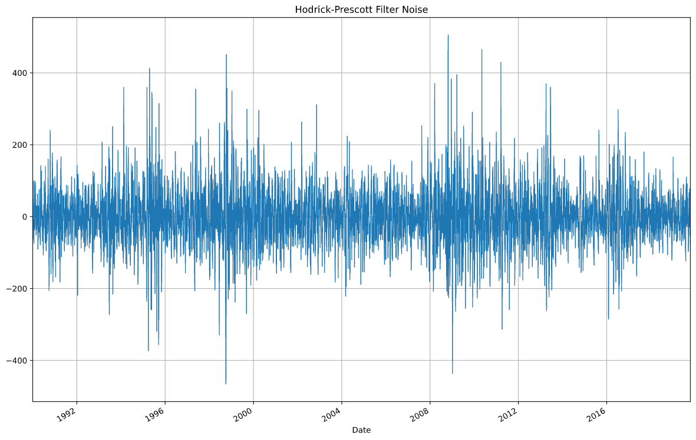

# Time Series Yen Currency Report

## Overview

The financial departments of large companies often deal with foreign currency transactions while doing international business. As a result, they are always looking for anything that can help them better understand the future direction and risk of various currencies. Hedge funds, too, are keenly interested in anything that will give them a consistent edge in predicting currency movements.

In this assignment, I will test the many time-series tools that I have learned in order to predict future movements in the value of the Japanese yen versus the U.S. dollar.

I will demonstrate my proficiency in the following:

1. Time Series Forecasting
2. Linear Regression Modeling

- - -

### Files

[Time-Series Analysis](Starter_Code/time_series_analysis.ipynb)

[Linear Regression Analysis](Starter_Code/regression_analysis.ipynb)

[Yen Currency Data-RAW](Starter_Code/yen.csv)

- - -

### Pseudocode

#### Imported Libaries

1. numpy
2. pandas
3. pathlib
4. sklearn.linear_model.LinearRegression
5. sklearn.metrics
6. statsmodels.api
7. statsmodels.tsa.arima_model.ARMA
8. statsmodels.tsa.arima_model.ARIMA
9. arch_model.arch

#### Time-Series Forecasting

In this notebook, I load historical Dollar-Yen exchange rate futures data and apply time series analysis and modeling to determine whether there is any predictable behavior.

Steps Taken

1. Decomposition using a Hodrick-Prescott Filter (Decompose the Settle price into trend and noise).
2. Forecasting Returns using an ARMA Model.
3. Forecasting the Settle Price using an ARIMA Model.
4. Forecasting Volatility with GARCH.

The results of the time series analysis and modeling were used to answer the following questions:

* Based on my time series analysis, would I buy the yen now?
* Is the risk of the yen expected to increase or decrease?
* Based on the model evaluation, do I feel confident in using these models for trading?

#### Linear Regression Forecasting

In this notebook, I build a Scikit-Learn linear regression model to predict Yen futures ("settle") returns with *lagged* Yen futures returns and categorical calendar seasonal effects (e.g., day-of-week or week-of-year seasonal effects).

Steps Taken:

1. Data Preparation (Creating Returns and Lagged Returns and splitting the data into training and testing data)
2. Fitting a Linear Regression Model.
3. Making predictions using the testing data.
4. Out-of-sample performance.
5. In-sample performance.

The results of the linear regression analysis and modeling were used to answer the following question:

* Does this model perform better or worse on out-of-sample data compared to in-sample data?
* Out-of-sample data is data that the model hasn't seen before (Testing data).
* In-sample data is data that the model was trained on (Training data).

- - -

### Conclusions and Considerations

#### Time-Series Summary

1. Decomposition using a Hodrick-Prescott Filter (Decompose the Settle price into trend and noise).

Settle price and Trend plot

Plot of Noise

2. Forecasting Returns using an ARMA Model.

Summary of Results Table

5 Day Forecasted Plot

3. Forecasting the Settle Price using an ARIMA Model.

Summary of Results Table

5 Day Forecasted Plot

4. Forecasting Volatility with GARCH.

Summary of Results Table

5 Day Forecasted Plot

SUMARY OF TIME_SERIES ANALYSIS

* Based on my time series analysis, would I buy the yen now?
Summary of time series analysis shows that it would be highly risky to buy the yen right now.
* Is the risk of the yen expected to increase or decrease?
Based on the model, the value of the yen has higher probability of decreasing which in turn lowers the vaue of exchange in the US  markets, on top of expected volatility shown from the GARCH analysis, I would say the risk is supposed to increase.
* Based on the model evaluation, do I feel confident in using these models for trading?
I would not be confident in using these models for trading given that I have no idea as to what all these numbers and values represent. I would stick to the skills that are already creating value for me and keep working on these new skills for a better understanding.

#### Linear Regression Summary

1. Data Preparation (Creating Returns and Lagged Returns and splitting the data into training and testing data)
Summary Table

2. Fitting a Linear Regression Model.

3. Making predictions using the testing data.

20day Forecasted Plots

4. Out-of-sample performance.

5. In-sample performance.

SUMMARY OF LINEAR REGRESSION MODEL

* Does this model perform better or worse on out-of-sample data compared to in-sample data?

The model has a root mean square error of 0.414% on out-of-sample data and 0.706% on in-sample data. Hence, the model performs better with (Testing data) that it has not worked with before.

##Out-of-sample data is data that the model hasn't seen before (Testing data).

##In-sample data is data that the model was trained on (Training data).

- - -
